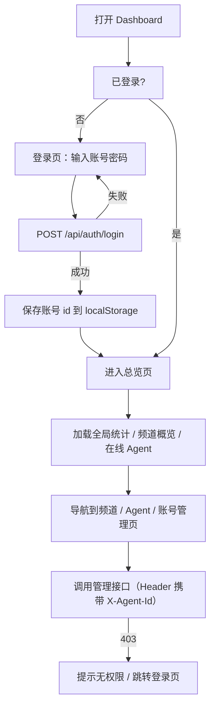

# ACP Relay Dashboard — 产品需求文档（PRD）

## 1. 产品概述

面向 ACP Relay（Java Spring Boot 实现的自定义信封协议转发服务）的管理后台，用于运维人员监控 relay 运行状态、管理频道与 Agent、维护超管账号。目标用户为 relay 的运维 / 管理员（"人"，非 agent），通过账号密码登录后进行全局管理。

## 2. 核心功能

### 2.1 用户角色

| 角色 | 登录方式 | 核心权限 |
|------|----------|----------|
| 超管（管理员） | 账号 + 密码（`POST /api/auth/login`） | 查看全局统计、管理频道（列表/详情/归档）、查看 Agent 在线状态、管理超管账号 |

> 账号由 `relay_super_admins` 表维护；表为空时 relay 启动自动 bootstrap 首个账号 `admin / admin123`。

### 2.2 功能模块

1. **登录页**：账号密码登录，登录成功后把账号 id 存入本地，后续请求在 Header `X-Agent-Id` 携带
2. **总览页（Dashboard）**：全局统计卡片（信封数 / 频道数 / Agent 数 / 超管数 / 在线 Agent 数）+ 频道概览列表 + 在线 Agent 列表
3. **频道管理页**：频道列表（名称/类型/可见性/成员数/信封数/归档状态）、频道详情（成员列表 + 信封数）、归档/取消归档
4. **Agent 管理页**：全部 Agent 列表（sandbox_id / 状态 / 活跃任务 / 心跳时间 / 在线状态）
5. **账号管理页**：超管账号列表、创建账号、重置密码、删除账号、退出登录

### 2.3 页面详情

| 页面名称 | 模块名称 | 功能描述 |
|----------|----------|----------|
| 登录页 | 登录表单 | 账号 + 密码，调用 `/api/auth/login`，错误提示；成功后跳转总览页 |
| 登录页 | 系统信息 | 展示产品名、版本、登录提示（默认账号说明） |
| 总览页 | 统计卡片 | 信封总数 / 频道总数 / Agent 总数 / 超管账号数 / 在线 Agent 数（在线数随 Redis presence 实时刷新） |
| 总览页 | 频道概览 | 最近创建的频道列表（前 N 个，含成员数/信封数） |
| 总览页 | 在线 Agent | 当前在线 Agent 列表（instance_id 归属） |
| 频道管理页 | 频道列表 | 分页/滚动列表，支持按归档状态筛选，含各频道统计 |
| 频道管理页 | 频道详情 | 抽屉/弹层展示频道信息 + 成员角色列表 + 信封数 |
| 频道管理页 | 归档操作 | 归档 / 取消归档（header 携带账号 id） |
| Agent 管理页 | Agent 列表 | 全部 Agent 及在线状态、状态徽章、活跃任务数 |
| 账号管理页 | 账号列表 | 账号 / 显示名 / 启用状态 / 创建时间 / 最近登录 |
| 账号管理页 | 创建账号 | 表单创建新超管账号 |
| 账号管理页 | 密码重置 | 重置指定账号密码 |
| 账号管理页 | 删除账号 | 删除账号（不可删除当前登录账号，前端禁用该按钮） |

## 3. 核心流程

## 4. 用户界面设计

### 4.1 设计风格

- **主题方向**：深空任务控制台（Deep-Space Mission Control）——深色背景、数据遥测质感、克制而精致的发光强调色
- **主色**：深空蓝黑背景 `#0B1120`，强调色青蓝 `#22D3EE`/`#38BDF8`，次级强调琥珀 `#F59E0B`（警告）、翠绿 `#34D399`（在线/成功）、玫红 `#FB7185`（错误/删除）
- **卡片**：半透明深色卡片（`rgba(255,255,255,0.03)`）+ 1px 微光描边，hover 时描边提亮
- **字体**：
  - 数字/遥测数据：`JetBrains Mono`（等宽，仪表感）
  - 标题/展示：`Sora` 或 `Unbounded`（几何感、现代科技向）
  - 正文：`PingFang SC` / 系统中文 + 英文衬底
- **背景**：深色渐变 + 细网格纹理 + 顶部微弱径向辉光，营造"任务控制"氛围
- **动效**：页面加载时统计卡片错峰上浮（staggered reveal）、数字滚动动画、在线状态呼吸灯、hover 微交互
- **布局**：左侧固定导航（图标 + 文字）+ 顶部栏（页面标题 + 当前登录账号 + 退出登录）+ 内容区卡片网格

### 4.2 页面设计总览

| 页面名称 | 模块名称 | UI 元素 |
|----------|----------|---------|
| 登录页 | 登录卡片 | 居中玻璃拟态卡片、产品 Logo 发光字、背景网格 + 辉光、登录按钮渐变高亮 |
| 登录页 | 表单 | 深色输入框 + 聚焦发光描边、错误提示红色呼吸 |
| 总览页 | 统计卡片 | 5 张大数字卡：等宽字体大数字 + 标签 + 图标 + 数字滚动动画 |
| 总览页 | 频道/在线 Agent | 表格化列表卡，在线状态用呼吸圆点 |
| 频道管理页 | 频道列表 | 表格 + 状态徽章（open/private、stream/forum/dm）、归档开关按钮 |
| 频道管理页 | 频道详情 | 右侧抽屉：成员列表带角色徽章（admin/member） |
| Agent 管理页 | Agent 列表 | 表格 + 在线呼吸点 + idle/busy 徽章 + 活跃任务数 |
| 账号管理页 | 账号列表 | 表格 + 启用状态徽章 + 操作按钮（重置密码/删除） |
| 账号管理页 | 创建/重置表单 | 弹层表单，密码输入带强度提示 |

### 4.3 响应式

桌面优先（最小宽度 1024px 完整布局）；1280px 以下导航收窄为图标模式；统计卡片网格自适应 1~5 列。本 Dashboard 面向桌面运维场景，不做移动端深度适配。

## 5. 非功能需求

- 所有管理请求 Header 携带 `X-Agent-Id: <登录账号>`；收到 403 时清除本地登录态并跳转登录页
- 在线 Agent 数据每 15s 轮询刷新（Presence TTL 60s）
- 无后端代码改动：完全复用现有 REST API
