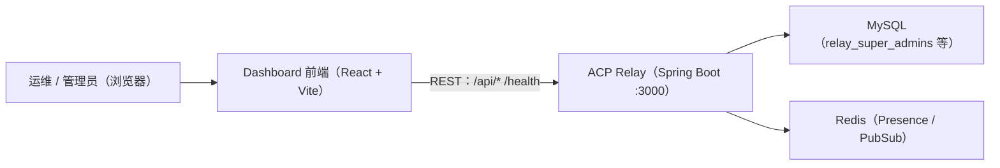

# ACP Relay Dashboard — 技术架构文档

## 1. 架构设计



## 2. 技术说明

- **前端**：React 18 + TypeScript + Vite + Tailwind CSS 3
- **路由**：React Router v6（登录页 / 总览页 / 频道页 / Agent 页 / 账号页）
- **数据请求**：原生 `fetch` 封装（轻量、无额外依赖），登录态存 `localStorage`
- **图标**：lucide-react（统一线性图标）
- **图表**：无重型图表库，统计用自定义数字卡片 + 极简 SVG 迷你走势（避免依赖膨胀）
- **后端**：复用现有 ACP Relay REST API，**零后端改动**
- **开发代理**：Vite dev server 将 `/api` 与 `/health` 代理到 `http://localhost:3000`，规避 CORS
- **初始化工具**：vite（手动搭建目录，无脚手架模板）

## 3. 路由定义

| 路由 | 用途 |
|------|------|
| `/login` | 登录页 |
| `/` | 总览页（默认重定向到 `/overview`） |
| `/overview` | 总览页：全局统计 + 频道概览 + 在线 Agent |
| `/channels` | 频道管理页 |
| `/agents` | Agent 管理页 |
| `/accounts` | 账号管理页 |

> 受保护路由统一校验：无登录账号时重定向 `/login`。

## 4. API 定义（对接现有后端）

```ts
// 登录
POST /api/auth/login
body: { username: string; password: string }
res:  { ok: true; username: string; display_name: string; enabled: boolean; last_login_at_ms: number | null }

// 全局统计
GET /api/admin/stats            // header: X-Agent-Id
res: { instance_id: string; envelope_count: number; channel_count: number;
       agent_count: number; super_admin_count: number; online_agent_count: number }

// 频道
GET    /api/channels            // header: X-Agent-Id（超管返回全部）
GET    /api/channels/{id}       // 频道详情
POST   /api/channels/{id}/archive  // body: { archived: boolean }

// Agent
GET /api/agents                 // header: X-Agent-Id，含 online 字段

// 账号
GET    /api/admin/accounts
POST   /api/admin/accounts      // body: { username, password, display_name }
DELETE /api/admin/accounts/{username}
POST   /api/admin/accounts/{username}/password  // body: { password }
```

> 所有受保护接口统一在 Header 携带 `X-Agent-Id: <username>`；403 响应触发登出。

## 5. 目录结构

```text
relay/dashboard/
├── index.html
├── package.json
├── vite.config.ts          # 代理 /api、/health → :3000
├── tailwind.config.js
├── postcss.config.js
├── tsconfig.json
└── src/
    ├── main.tsx
    ├── App.tsx             # 路由 + 登录态守卫
    ├── index.css           # 主题变量、网格背景、动效
    ├── api/client.ts       # fetch 封装（X-Agent-Id header、403 处理）
    ├── types.ts            # API 类型
    ├── components/         # 布局（Sidebar/Header）、StatCard、Table、Badge、Modal、Drawer、Toast
    └── pages/
        ├── LoginPage.tsx
        ├── OverviewPage.tsx
        ├── ChannelsPage.tsx
        ├── AgentsPage.tsx
        └── AccountsPage.tsx
```

## 6. 关键设计

- **登录态**：`localStorage["relay_dash_username"]` 保存账号；API 客户端自动附加 `X-Agent-Id` header
- **数据刷新**：总览页统计与在线 Agent 每 15s 轮询（`setInterval` + `useEffect` 清理）
- **错误处理**：统一 Toast 提示；403 清除登录态跳转 `/login`
- **风格落地**：CSS 变量定义主题色；`index.css` 提供深色渐变背景、网格纹理、卡片微光描边；数字卡片使用 `JetBrains Mono` + 入场滚动动画
